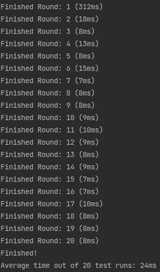

## <u>Practical 2</u>
### Functional Tests
- Test if datasets are being sent out and received [PASSED]
- Test if datasets from multiple sensors are being received and distinction of sensor data possible [PASSED]
- Test if sending and receiving datasets is possible within docker network and with docker-compose [PASSED]

### Performance Tests
- Test case where 10.000 datasets of sensor data is sent out was created and time was measured. [2,45sec / PASSED | Condition: < 5000ms]

## <u>Practical 3</u>
### Functional Tests
- Database Connection established [PASSED]
- Sending Test data to database [PASSED]
- Call RPC Method persist-Data from ManagementCenter and look if data is being persisted in MongoDB [PASSED]

### Performance Tests
- Latency within range of usability [PASSED]
- Checked Round-Trip Trip Time of Request (RPC Call from MC --> CloudServer RPCHandler --> DB Persist())

## <u>Practical 4</u>
### Functional Tests
- MQTT Broker and Client connection working [PASSED]
- Broker transmits data to the subscriber with the corresponding topic [PASSED]
- Containerized network is working [PASSED]

### Performance Tests
#### Runtime measurements UDP vs. MQTT
- 1 Round = 10.000 datasets
- Average time of 20 test runs

UDP            |  MQTT
:-------------------------:|:-------------------------:
  |  

## <u>Practical 5</u>
### Functional Tests
- NGINX Loadbalancer passes requests from ManagementCenters to Cloudservers (Round Robin) probes server for connectivity in background [PASSED]
- Sensordata is being persisted by multiple Cloudservers [PASSED]
- DB-Cluster is replicating data onto its replicaset members [PASSED]

### Performance Tests
#### Failure Tests
- Managementcenters can fail and are reconnecting with RPC automatically [PASSED]
- Cloudservers can fail and sensordata is being sent to the next available cloudserver [PASSED]
- If all cloudservers are in failstate. Sensordata is being retained by the mcs and sent out after a reconnect [PASSED]

#### Protocol for checking db consistency
- localhost:8085 for mongoexpress check database entries respecively collections
- checking data replication of replicaset members via mongoclient connect:
  - <b>mongo --host localhost:[10001-10003]</b> (10002 & 10003 = SECONDARY)
  - use SmartHome
  - <b>rs.slaveOk()</b> (Telling replicaset, that we are reading from secondary members)
  - <b>db.SmartHome.count()</b> (Comparing dataset counts of all replicaset members)

