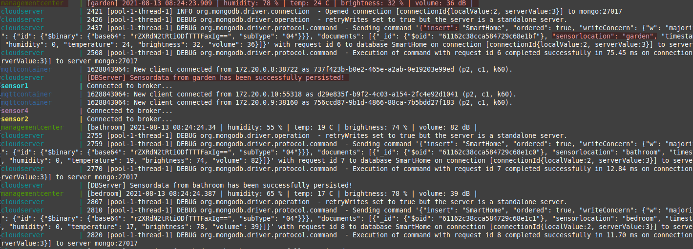
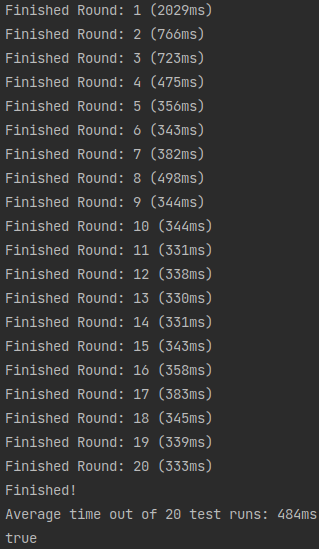
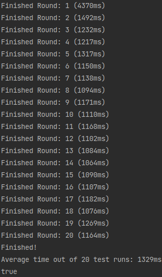

## <u>Practical 2</u>
### Functional Tests
- Test if datasets are being sent out and received [PASSED]
- Test if datasets from multiple sensors are being received and distinction of sensor data possible [PASSED]
- Test if sending and receiving datasets is possible within docker network and with docker-compose [PASSED]

### Performance Tests
- Test case where 10.000 datasets of sensor data is sent out was created and time was measured. [2,45sec / PASSED | Condition: < 5000ms]

## <u>Practical 3</u>
### Functional Tests
- Database Connection established [PASSED]
- Sending Test data to database [PASSED]
- Call RPC Method persist-Data from ManagementCenter and look if data is being persisted in MongoDB [PASSED]

### Performance Tests
- Latency within range of usability [PASSED]

## <u>Practical 4</u>
### Functional Tests
- MQTT Broker and Client connection working [PASSED]
- Broker transmits data to the subscriber with the corresponding topic [PASSED]
- Containerized network is working [PASSED]

### Performance Tests
#### Runtime measurements UDP vs. MQTT
- 1 Round = 10.000 datasets
- Average time of 20 test runs

UDP            |  MQTT
:-------------------------:|:-------------------------:
  |  